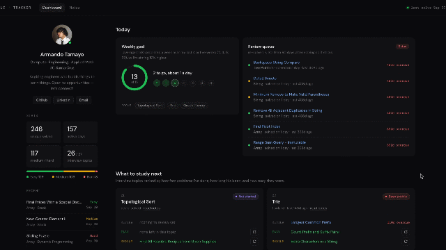

# LC Tracker

I've been grinding LeetCode every day trying to get better at interviews, and at some point 
I realized I had no real visibility into what I was actually improving at. I could see my 
submission count go up but I had no idea if I was actually getting stronger or just doing 
easy array problems on repeat. So I built this.

LC Tracker is a personal analytics dashboard that pulls my LeetCode activity in real time, 
stores it, and uses a weighted scoring model to tell me exactly what I should be practicing 
next — with direct links to problems and a reroll button if I don't like the suggestion.

## Live Demo



**[lcdashboard.live](https://www.lcdashboard.live/)**

---

## What It Does

- **Tracks every accepted submission automatically.** A poller checks LeetCode every 10 minutes, and the dashboard shows unique solves, difficulty split, activity heatmap, and cumulative progress.
- **Tells me what to study next.** An ML scoring model ranks the 27 topics that actually show up in interviews and suggests one Easy and one Medium problem for each (premium problems filtered out), each with its own reroll.
- **Makes me review what I've already solved.** Spaced repetition brings every solved problem back 1, 7, 30, then 90 days later, and a review queue lists the most overdue ones.
- **Sets a weekly goal that adapts to me.** 10% above my recent average, or half my old pace when I'm coming back from a break.
- **Holds my study notes.** One page per interview topic with step through diagrams, commented templates, worked examples, and a practice list that checks off what I've solved.

---

## How It Works

### The pipeline

Every 10 minutes a poller hits LeetCode's GraphQL API using my session credentials and 
fetches my latest submissions. It skips anything already saved, enriches new ones with topic 
tags and difficulty from a second query, then drops them into a Redis queue. A background 
worker blocks on the queue (`BLPOP`) and writes each submission to PostgreSQL, retrying with 
exponential backoff if Redis or Postgres drops the connection. The FastAPI backend serves 
everything to the React dashboard, with Redis also acting as a read cache so the database 
never gets hammered. Once a week the scheduler re-syncs the full list of 4,000+ LeetCode 
problems, including which ones are premium.

### The recommender

The ML recommendation engine scores every interview topic (a fixed list of 27 in 
`ml/topics.py`, so niche tags like Randomized or Game Theory are ignored) using three weighted 
factors:
```
priority_score = (1 / (count + 1)) * recency_weight * difficulty_weight
```

- **Count**: how many unique problems I've done in this topic (Laplace smoothed so zero count 
  topics don't divide by zero and naturally float to the top)
- **Recency**: how long since I last touched the topic, on a log scale so a 100 day gap 
  doesn't completely dominate a 30 day gap. Topics I've never touched count as a full year stale.
- **Difficulty**: if I've only done easy problems in a topic, the weight goes up

Each of the top 10 topics comes with a problem to review and two new problems to try, one Easy 
and one Medium (for days when my brain is fried vs. days I want real interview practice).

### Spaced repetition

Every solved problem is due again 1, 7, 30, then 90 days after I solve it, based on how many 
different days I've solved it. The most overdue one in each topic becomes that topic's review 
problem. Re-solving it on LeetCode automatically pushes it to the next, longer interval, since 
it's all worked out from the submissions table (`ml/review.py`).

### Weekly goal

The goal is 10% above my average over my last 4 active weeks, clamped between 5 and 20. After 
3 or more weeks off it starts at half my old pace instead (`ml/goal.py`).

### Study notes

The Notes tab has a page for each of the 27 interview topics: the core idea, step through 
diagrams of the algorithm running, commented Python templates, worked LeetCode examples, and a 
practice list that checks off the problems I've already solved. Topics I haven't touched in 
over a month show up under "Worth rereading", and every study card links to its notes.

Notes live in `dashboard/src/notes/content/<topic>.md`, and their diagrams in 
`dashboard/src/notes/diagrams/<topic>.jsx`, built from a small SVG kit in 
`dashboard/src/notes/kit/`. `python dashboard/scripts/check_notes.py` checks every note for 
broken diagrams, invalid Python, and malformed practice lists.

---

## Architecture
```
                 every 10 min                      BLPOP
LeetCode GraphQL ────────────► Poller ──► Redis queue ──► Worker ──► PostgreSQL
                               (weekly: full problem list sync)          │
                                                                          ▼
React dashboard ◄──── FastAPI ◄──── Redis cache ◄──── ML: recommender, spaced
 (Vercel)            (Railway)                         repetition, weekly goal
```

---

## Stack

**Backend**
- Python · FastAPI · APScheduler
- PostgreSQL · Redis (queue + cache)
- psycopg2 · python-dotenv

**Frontend**
- React · Vite
- Recharts (radar chart, progress chart)
- Custom SVG diagram kit for the notes (arrays, trees, graphs, grids, stacks, step through player)
- react-markdown · prism-react-renderer

**Infrastructure**
- Railway: FastAPI, worker, scheduler, PostgreSQL, Redis (services talk over private networking)
- Vercel: React frontend

---

## Project Layout

```
backend/     FastAPI app, Postgres helpers, Redis queue + cache, queue worker
poller/      LeetCode GraphQL client and the scheduler (10 min polls, weekly problem sync)
ml/          recommender, spaced repetition, weekly goal, interview topic list, problem sync
dashboard/   React app: dashboard page, notes page, notes content and diagram kit
```

---

## Running Locally
```bash
# clone and install
git clone https://github.com/MandoBug/leetcode-tracker
cd leetcode-tracker
pip install -r requirements.txt

# set up .env
cp .env.example .env
# fill in LEETCODE_SESSION, LEETCODE_CSRF, DATABASE_URL (or DB_*), REDIS_URL

# fill the problems table (and premium flags) once; the scheduler re-syncs it weekly
python -m ml.fetch_problems

# start postgres and redis locally, then run
uvicorn backend.main:app --port 8000   # terminal 1: API
python -m backend.worker               # terminal 2: queue worker
python -m poller.scheduler             # terminal 3: poller
cd dashboard && npm install && VITE_API_URL=http://localhost:8000 npm run dev   # terminal 4
```

---

## Why I Built This

I bought a binary star for my girlfriend and I for our anniversary and ended up building 
a physics simulation to visualize it. That project reminded me that the best way to learn 
something is to build something personal around it. I was already grinding LeetCode every 
day — building a tool that actively tells me what's weak and what to do next just made 
sense. Now the dashboard tells me what to work on and I can actually see myself getting 
better over time.