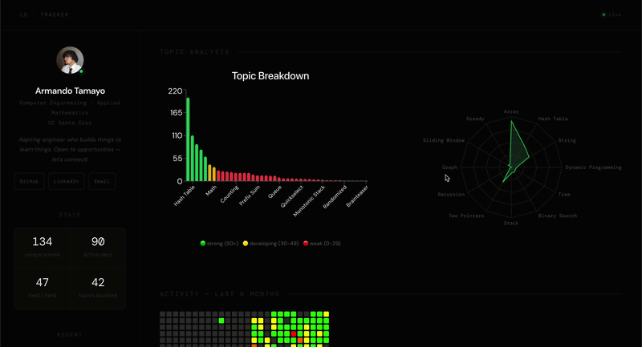

# LC Tracker

I've been grinding LeetCode every day trying to get better at interviews, and at some point 
I realized I had no real visibility into what I was actually improving at. I could see my 
submission count go up but I had no idea if I was actually getting stronger or just doing 
easy array problems on repeat. So I built this.

LC Tracker is a personal analytics dashboard that pulls my LeetCode activity in real time, 
stores it, and uses a weighted scoring model to tell me exactly what I should be practicing 
next — with direct links to problems and a reroll button if I don't like the suggestion.

## Live Demo



**[lcdashboard.dev](https://www.lcdashboard.live/)** — live at your own domain once connected

---

## How It Works

Every 10 minutes a poller hits LeetCode's GraphQL API using my session credentials and 
fetches my latest submissions. It enriches each one with topic tags and difficulty from 
a second query, then drops them into a Redis queue. A background worker pulls from the 
queue one at a time and writes to PostgreSQL. The FastAPI backend serves everything to 
the React dashboard via cached endpoints, with Redis handling both the queue and the 
read cache so the database never gets hammered.

The ML recommendation engine sits on top of PostgreSQL and scores every interview topic 
(a fixed list of 27 in `ml/topics.py` — niche tags like Randomized or Game Theory are ignored) 
using three weighted factors:
```
priority_score = (1 / (count + 1)) * recency_weight * difficulty_weight
```

- **Count** — how many unique problems I've done in this topic (Laplace smoothed so zero-count 
  topics don't divide by zero and naturally float to the top)
- **Recency** — how long since I last touched the topic, on a log scale so a 100-day gap 
  doesn't completely dominate a 30-day gap
- **Difficulty** — if I've only done easy problems in a topic, the weight goes up

Each recommendation comes with a problem to review and two new problems to try, one Easy 
and one Medium (for days when my brain is fried vs. days I want real interview practice), 
pulled from a local table of all 3,800+ LeetCode problems with premium ones filtered out. 
Each suggestion has its own reroll button.

The review problem comes from **spaced repetition**: every solved problem is due again 1, 7, 
30, then 90 days after I solve it, and the most overdue one in each topic gets surfaced. 
Re-solving it on LeetCode automatically pushes it to the next, longer interval, since it's all 
worked out from the submissions table. A review queue on the dashboard shows the most overdue 
problems across every topic.

A **weekly goal** adapts to my pace: 10% above my average over my last 4 active weeks, or half 
my old pace when I'm coming back from a break.

## Study Notes

The Notes tab has a page for each of the 27 interview topics: the core idea, step through 
diagrams of the algorithm running, commented Python templates, worked LeetCode examples, and a 
practice list that checks off the problems I've already solved. Notes I haven't touched in over 
a month show up under "Worth rereading", and every study card links to its topic's notes.

Notes live in `dashboard/src/notes/content/<topic>.md`, and their diagrams in 
`dashboard/src/notes/diagrams/<topic>.jsx`, built from a small SVG kit in 
`dashboard/src/notes/kit/`. `python dashboard/scripts/check_notes.py` checks every note for 
broken diagrams, invalid Python, and malformed practice lists.

---

## Architecture
```
LeetCode → Poller → Redis (queue) → Worker → PostgreSQL
                                        ↑
                                   Redis (cache)
                                        ↓
                          FastAPI → React Dashboard
                               ↑
                          ML Recommender
```

---

## Stack

**Backend**
- Python · FastAPI · APScheduler
- PostgreSQL · Redis
- psycopg2 · python-dotenv

**Frontend**
- React · Vite
- Recharts (bar chart, radar chart, line chart)
- Custom activity heatmap

**Infrastructure**
- Railway — FastAPI, worker, scheduler, PostgreSQL, Redis
- Vercel — React frontend

---

## Features

- Real-time submission tracking via LeetCode GraphQL API
- Redis message queue decoupling poller from database writes
- ML-powered topic recommendations, limited to interview topics, with tiered prioritization
- Easy + Medium suggestions per topic, premium problems filtered out
- Spaced repetition review queue (1, 7, 30, 90 days)
- Adaptive weekly goal with a days-practiced tracker
- My study notes for 27 interview topics, with interactive diagrams
- GitHub-style activity heatmap for the last 6 months
- Interview readiness radar (progress toward 15 problems per core topic)
- Per-topic breakdown with an interview-only / all-tags toggle
- Cumulative progress line chart
- Reroll button for new problem suggestions
- Redis read cache on all endpoints for fast dashboard loads
- Auto-polling every 10 minutes via APScheduler, skipping submissions that are already saved
- Worker survives Redis/Postgres drops with exponential backoff instead of crashing

---

## Running Locally
```bash
# clone and install
git clone https://github.com/MandoBug/leetcode-tracker
cd leetcode-tracker
pip install -r requirements.txt

# set up .env
cp .env.example .env
# fill in LEETCODE_SESSION, LEETCODE_CSRF, DB_*, REDIS_URL

# fill the problems table (and premium flags) once; the scheduler re-syncs it weekly
python -m ml.fetch_problems

# start postgres and redis locally, then run
python -m backend.worker        # terminal 1
python -m poller.scheduler      # terminal 2
cd dashboard && npm install && npm run dev  # terminal 3
```

---

## Why I Built This

I bought a binary star for my girlfriend and I for our anniversary and ended up building 
a physics simulation to visualize it. That project reminded me that the best way to learn 
something is to build something personal around it. I was already grinding LeetCode every 
day — building a tool that actively tells me what's weak and what to do next just made 
sense. Now the dashboard tells me what to work on and I can actually see myself getting 
better over time.